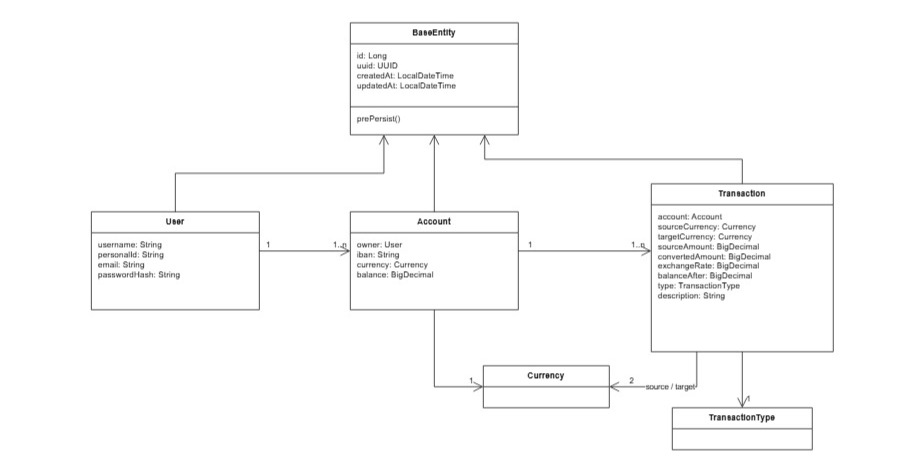
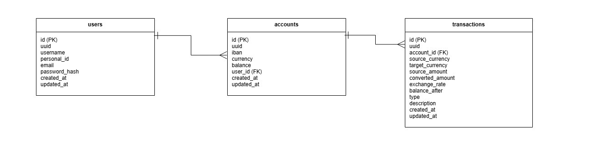
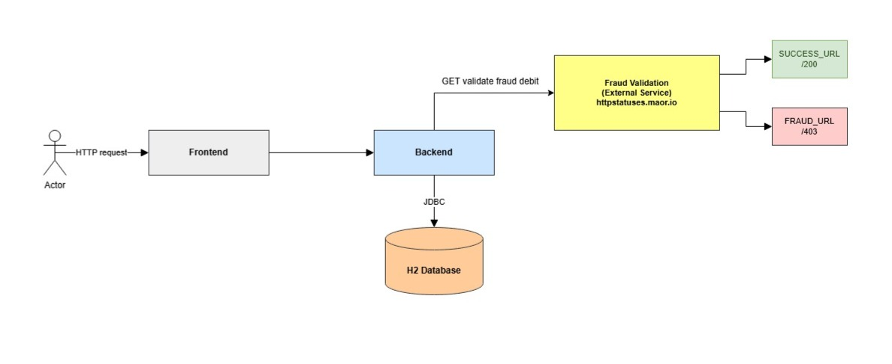

# Bank App

Homework assignment — Software Developer (Full Stack, Backend Focus) – Swedbank

A bank application developed as a technical assignment, split into two parts as requested: **Part 1** — a REST API in Java/Spring Boot for banking operations, and **Part 2** — an Angular SPA that consumes that API.

## Table of Contents

1. [What this project does](#what-this-project-does)
2. [Compliance with challenge requirements](#compliance-with-challenge-requirements)
3. [Fraud Validation Flow](#integration-with-external-fraud-prevention-system)
4. [Prerequisites](#prerequisites)
5. [How to run the project](#how-to-run-the-project)
6. [First access](#first-access)
7. [Navigating the application](#navigating-the-application)
8. [Seed data (mocks) and H2 Console](#seed-data-mocks-and-h2-console)
9. [REST API — quick reference](#rest-api--quick-reference)
10. [Architecture and technical decisions](#architecture-and-technical-decisions)
11. [Common issues](#common-issues)

---

## What this project does

| Layer        | Technologies                            | Responsibility                                                                         |
| ------------ | --------------------------------------- | -------------------------------------------------------------------------------------- |
| **Backend**  | Java 25, Spring Boot 4, H2, Flyway, JWT | Accounts, credit/debit, currency exchange, transaction history, PDF, authentication    |
| **Frontend** | Angular 21, NgRx, Jest                  | Home (accounts), Account Overview (balance, history, chart), Transaction Overview, PDF |

Core features (mapped directly to challenge requirements):

- **Add money to account (credit):** accepts amounts in a different currency from the account, automatically converting using a fixed exchange rate table.
- **Debit money from account:** the debit currency **must match the account currency** — no automatic conversion, as required.
- **Check account balance.**
- **Currency exchange:** fixed rates between EUR, USD, SEK, GBP, and VND, used both for the exchange rate query and for automatic credit conversion.
- **Paginated transaction history** per account.
- **External system call simulation — Fraud Detection:** Before each debit, via an HTTP call to a status-testing service (`https://httpstatuses.maor.io`).
- **Multiple accounts per user**, each with exactly one currency (EUR, USD, SEK, GBP, VND).
- **SQL database persistence** (H2, in-memory) with schema versioning via Flyway.
- **Self-contained microservice** — independent backend, no dependency on other services to operate.

Frontend features (Part 2):

- **Home Page:** lists all accounts for the logged-in user, with each account's balance and currency; clicking navigates to Account Overview.
- **Account Overview Page:** account balance and currency; transaction history with **infinite scroll** (incremental loading without reload); clicking a transaction navigates to Transaction Overview; **line chart** of historical balance over time.
- **Transaction Overview Page:** details of the selected transaction; button to **export and download the receipt as PDF**.
- **NgRx** for state management

> Note from the challenge: the focus was on functionality, not aesthetics — the interface is functional, without investment in refined visual design.

---

### Class diagram

C:\Users\eafon\OneDrive\Documentos\desenvolvimento\assigment\bank-app\readme-images\bank_architecture_diagram.jpg


### Database diagram



### Architecture diagram



---

## Compliance with challenge requirements

### Part 1 — REST API

| Requirement                                                     | Status | Where / how                                                      |
| --------------------------------------------------------------- | ------ | ---------------------------------------------------------------- |
| Add money to account                                            | ✅     | `POST /api/transactions/credit`                                  |
| Debit money from account                                        | ✅     | `POST /api/transactions/debit`                                   |
| Check account balance                                           | ✅     | `GET /api/accounts/balance/{iban}`                               |
| Currency exchange (fixed rates)                                 | ✅     | `GET /api/currencies`                                            |
| Transaction history per account                                 | ✅     | `GET /api/transactions/history/{iban}`                           |
| User can have multiple accounts with separate balances          | ✅     | 1:N relationship between `users` and `accounts`                  |
| Each account has exactly one currency (EUR, USD, SEK, GBP, VND) | ✅     | `currency` field in `accounts`                                   |
| Debit uses only one currency (no automatic exchange)            | ✅     | Service validation: request currency must match account currency |
| External system call simulation before debiting                 | ✅     | HTTP call to a status service simulating external logging        |
| Self-contained microservice                                     | ✅     | Independent backend, no dependency on other services             |
| SQL database persistence                                        | ✅     | H2 in-memory, with Flyway for schema and seeds                   |

### Part 2 — Frontend (Angular)

| Requirement                                                 | Status | Where / how                                                 |
| ----------------------------------------------------------- | ------ | ----------------------------------------------------------- |
| Home Page lists all user accounts with balance and currency | ✅     | `/dashboard`                                                |
| Clicking an account navigates to Account Overview           | ✅     | Angular routing                                             |
| Account Overview shows account balance and currency         | ✅     | `/accounts/:iban`                                           |
| Transaction history with limited initial load               | ✅     | Backend pagination (5 per page)                             |
| Infinite scroll (more transactions loaded without reload)   | ✅     | `IntersectionObserver` in the history component             |
| Clicking a transaction navigates to Transaction Overview    | ✅     | Angular routing                                             |
| Line chart of historical balance (time vs. balance)         | ✅     | Custom SVG component, no external chart library             |
| Transaction Overview shows transaction details              | ✅     | `/transactions/:uuid`                                       |
| Button to export/download transaction PDF                   | ✅     | `POST /api/reports/transaction/pdf` + "Download PDF" button |
| NgRx (nice to have)                                         | ✅     | Global state: auth, accounts, account detail, transactions  |

---

### Integration with External Fraud Prevention System

As required by the challenge to simulate communication with an external system, the debit flow implements a synchronous validation step before any balance deduction or database persistence.

**How the flow works in practice:**

1. The user initiates a debit request via the Frontend, which sends the instruction to the Backend (`POST /api/transactions/debit`).
2. The Backend intercepts the intent and evaluates the requested amount to dynamically determine the simulation behavior:
   - **Fraud Trigger:** If the amount (`amount`) is exactly **5**, the backend directs the HTTP call to the blocking route (`/403`).
   - **Normal Flow:** For any other amount, the request is directed to the success route (`/200`).
3. An HTTP `GET` request is fired to the external status service (`https://httpstatuses.maor.io`).
4. **Response Handling:**
   - **Authorization scenario (`SUCCESS_URL` — HTTP 200):** The external service authorizes the operation. The Backend proceeds with the business rule, deducts the balance, and persists the transaction in the H2 Database safely.
   - **Blocking scenario (`FRAUD_URL` — HTTP 403):** The external service denies authorization. No database changes are made, and the API returns an authorization failure `Transaction could not be processed. Please contact support.` (HTTP 403) to the Frontend.

## How to run the project

### Fastest way — Docker Compose (Recommended)

From the repository root:

```bash
docker compose up --build
```

| Service       | URL                              |
| ------------- | -------------------------------- |
| Frontend      | http://localhost:4200            |
| Backend (API) | http://localhost:8080            |
| H2 Console    | http://localhost:8080/h2-console |

To stop:

```bash
docker compose down
```

---

### Option B — Run with Docker

| Tool           | Minimum version |
| -------------- | --------------- |
| Docker         | 20+             |
| Docker Compose | 2+              |

> **Important:** the frontend calls the API at `http://localhost:8080`. When running locally, start the backend **before** the frontend.

---

### Option C — Run locally (for development only)

| Tool       | Minimum version                     |
| ---------- | ----------------------------------- |
| Java (JDK) | **25**                              |
| Maven      | 3.9+ (or use the included `./mvnw`) |
| Node.js    | **20+**                             |
| npm        | 11+                                 |

To run the application locally for development, follow the steps below to start the backend and frontend separately.

---

#### 1. Running the Backend (via IDE)

You can run the backend Spring Boot application using either IntelliJ IDEA or Eclipse (Spring Tool Suite).

**Via IntelliJ IDEA (Recommended)**

1. Open IntelliJ IDEA and select **File > Open**.
2. Navigate to your project directory, select the backend root folder (containing the `pom.xml` file), and click **OK**.
3. Wait for IntelliJ to import the Maven dependencies.
4. Locate the main application class (the one annotated with `@SpringBootApplication`, usually named `Application.java` or `BankAppApplication.java`).
5. Right-click the file or inside the main method and select **Run 'Application.main()'** (or click the green Play button in the top toolbar).

**Via Eclipse / Spring Tool Suite (STS)**

1. Open Eclipse and go to **File > Import...**
2. Select **Maven > Existing Maven Projects** and click **Next**.
3. Browse to the root directory containing the backend `pom.xml` and click **Finish**.
4. Once the project builds, right-click the project root in the Project Explorer.
5. Select **Run As > Spring Boot App** (or **Run As > Java Application** and select your main class).

---

#### 2. Running the Frontend (via Angular CLI)

Before running the development server, ensure your Node.js and npm versions meet the minimum requirements.

1. Open your terminal or command prompt.
2. Navigate to the frontend directory:

```bash
   cd path/to/your/frontend-folder
```

3. Install the project dependencies (only needed the first time or when `package.json` changes):

```bash
   npm install
```

4. Start the local development server using `ng serve`:

```bash
   npx ng serve
```

> **Note:** If you have the Angular CLI installed globally (`npm install -g @angular/cli`), you can simply run `ng serve`. Using `npx ng serve` ensures it runs correctly using the project's local version.

5. Once compilation is complete, open your browser and navigate to:

```
   http://localhost:4200/
```

## First access

### Pre-registered users (seed)

Data is automatically inserted by the migrations in `backend/src/main/resources/db/migration/`.

| Name       | E-mail            | Password | Accounts                     |
| ---------- | ----------------- | -------- | ---------------------------- |
| John User  | `john@email.com`  | `123456` | 2 EUR accounts (IBANs below) |
| Jane Doe   | `jane@email.com`  | `123456` | 1 USD account                |
| Admin User | `admin@email.com` | `123456` | no accounts                  |

**John User's accounts (ideal for demo):**

| IBAN                   | Currency | Starting balance |
| ---------------------- | -------- | ---------------- |
| `EE382200221020145685` | EUR      | 90.8044          |
| `EE382200221020145686` | EUR      | 0                |

Account `EE382200221020145685` also has **40 sample historical transactions** — useful for testing infinite scroll and the balance chart.

### Create a new user

On the login screen, click **Create a new account**, fill in the fields, and log in. No need to use the H2 console for this.

---

## Navigating the application

```
Login → Home (accounts) → Account Overview → Transaction Overview
```

### 1. Login (`/login`)

Enter email and password. The JWT token is saved in `localStorage` and sent automatically with requests.

### 2. Home Page (`/dashboard`)

- Lists all accounts for the logged-in user.
- Displays balance and currency for each account.
- Allows **creating a new account** (by choosing the currency).
- Click an account to open Account Overview.

### 3. Account Overview (`/accounts/:iban`)

- Balance and currency of the selected account.
- **Transaction history** with infinite scroll (loads 5 at a time).
- **Line chart** of historical balance (filterable by date range).
- Form for **credit** (accepts currency conversion) and **debit** (same currency as account).
- Click a transaction to open Transaction Overview.

### 4. Transaction Overview (`/transactions/:uuid`)

- Full transaction details.
- **Download PDF** button to export the receipt.

---

## Seed data (mocks) and H2 Console

The database is **H2 in-memory**. Data exists while the application is running — restarting the backend resets everything to the state defined by the migrations.

### Accessing the H2 Console

1. With the backend running, open http://localhost:8080/h2-console
2. Fill in:

| Field         | Value                      |
| ------------- | -------------------------- |
| **JDBC URL**  | `jdbc:h2:mem:bank-backend` |
| **User Name** | `sa`                       |
| **Password**  | _(leave blank)_            |

3. Click **Connect**.

### Where the mocks are

Seeds are located in `backend/src/main/resources/db/migration/`:

| File                            | Content                           |
| ------------------------------- | --------------------------------- |
| `V2__SEED_ADD_USERS.sql`        | 3 users                           |
| `V4__SEED_ADD_ACCOUNTS.sql`     | 3 accounts                        |
| `V6__SEED_ADD_TRANSACTIONS.sql` | 40 transactions in John's account |

### Useful queries

```sql
-- View all users
SELECT id, username, email FROM users;

-- View accounts and balances
SELECT a.id, a.iban, a.currency, a.balance, u.email
FROM accounts a
JOIN users u ON u.id = a.user_id;

-- View transactions for an account
SELECT t.uuid, t.type, t.source_amount, t.balance_after, t.description, t.created_at
FROM transactions t
JOIN accounts a ON a.id = t.account_id
WHERE a.iban = 'EE382200221020145685'
ORDER BY t.created_at DESC;
```

### Inserting data manually via INSERT

Use the H2 Console to add data during a session (without restarting the backend).

#### New account for an existing user

```sql
INSERT INTO accounts (uuid, iban, currency, balance, user_id, created_at, updated_at)
VALUES (
  RANDOM_UUID(),
  'EE382200221020145688',
  'GBP',
  500.0000,
  1,  -- user id (1 = John User)
  CURRENT_TIMESTAMP,
  CURRENT_TIMESTAMP
);
```

#### New credit transaction

```sql
INSERT INTO transactions (
  uuid, account_id, source_currency, target_currency,
  source_amount, converted_amount, exchange_rate, balance_after,
  type, description, created_at, updated_at
)
VALUES (
  RANDOM_UUID(),
  1,           -- account id
  'EUR', 'EUR',
  100.0000, 100.0000, 1.00000000, 190.8044,  -- adjust balance_after to current balance + amount
  'CREDIT',
  'Manual deposit via H2',
  CURRENT_TIMESTAMP,
  CURRENT_TIMESTAMP
);

-- Also update the account balance to maintain consistency
UPDATE accounts SET balance = 190.8044, updated_at = CURRENT_TIMESTAMP WHERE id = 1;
```

> **Tip:** when inserting transactions manually, keep `accounts.balance` aligned with the `balance_after` of the most recent transaction. The API does this automatically; manual inserts require care.

#### New user

Prefer creating users via the frontend **registration** screen (the password is encrypted with BCrypt). If you need to insert via SQL, reuse the hash already present in `V2__SEED_ADD_USERS.sql` (password `123456`):

```sql
INSERT INTO users (uuid, username, personal_id, email, password_hash, created_at, updated_at)
VALUES (
  RANDOM_UUID(),
  'Demo User',
  '11122233344',
  'demo@email.com',
  '$2a$10$l7G9258dExxqkO2qkfuaROSs8Bz7AcmBoZD7CU9D5LG4EUgmoNTF2',
  CURRENT_TIMESTAMP,
  CURRENT_TIMESTAMP
);
```

---

## REST API — quick reference

Base URL: `http://localhost:8080`

Authentication: `Authorization: Bearer <token>` header (obtained at login). Public endpoints: `/api/auth/login`, `/api/users/create`, `/h2-console/**`.

> The complete Postman collection is available in the repository root (`bank-app.postman_collection.json`) and organizes the endpoints in the same folders used below: **login**, **user**, **account**, **transaction**, and **currency**.

### Login

| Method | Endpoint          | Auth | Description                         |
| ------ | ----------------- | ---- | ----------------------------------- |
| POST   | `/api/auth/login` | —    | Authenticates and returns JWT token |

```bash
curl -X POST http://localhost:8080/api/auth/login \
  -H "Content-Type: application/json" \
  -d '{
    "email": "john@email.com",
    "password": "123456"
  }'
```

Response: `{ "token": "..." }`

> In the collection, this request has a test script that automatically saves the returned token to the `{{token}}` environment variable, used as a bearer token in all subsequent requests.

### User

| Method | Endpoint                              | Auth | Description                   |
| ------ | ------------------------------------- | ---- | ----------------------------- |
| POST   | `/api/users/create`                   | —    | Creates a new user            |
| GET    | `/api/users/personal-id/{personalId}` | JWT  | Fetches a user by personal ID |

```bash
curl -X POST http://localhost:8080/api/users/create \
  -H "Content-Type: application/json" \
  -d '{
    "username": "Evandro Rodrigues",
    "personalId": "12345678914",
    "email": "evandrorodrigues@email.com",
    "password": "123456"
  }'
```

```bash
curl http://localhost:8080/api/users/personal-id/12345678913 \
  -H "Authorization: Bearer {{token}}"
```

### Account

| Method | Endpoint                       | Auth | Description                             |
| ------ | ------------------------------ | ---- | --------------------------------------- |
| POST   | `/api/accounts/create`         | JWT  | Creates account `{ "currency": "USD" }` |
| GET    | `/api/accounts`                | JWT  | Lists accounts for logged-in user       |
| GET    | `/api/accounts/{iban}`         | JWT  | Account details                         |
| GET    | `/api/accounts/balance/{iban}` | JWT  | Account balance                         |

```bash
curl -X POST http://localhost:8080/api/accounts/create \
  -H "Content-Type: application/json" \
  -H "Authorization: Bearer {{token}}" \
  -d '{
    "currency": "USD"
  }'
```

```bash
curl http://localhost:8080/api/accounts \
  -H "Authorization: Bearer {{token}}"
```

```bash
curl http://localhost:8080/api/accounts/EE382200221020145685 \
  -H "Authorization: Bearer {{token}}"
```

```bash
curl http://localhost:8080/api/accounts/balance/EE382200221020145685 \
  -H "Authorization: Bearer {{token}}"
```

> In the collection, the **create account** request has a test script that saves the returned IBAN to the `{{IBAN}}` variable, reused by the **get balance** request.

### Transaction

| Method | Endpoint                                                             | Auth | Description                                  |
| ------ | -------------------------------------------------------------------- | ---- | -------------------------------------------- |
| POST   | `/api/transactions/credit`                                           | JWT  | Credit (accepts currency conversion)         |
| POST   | `/api/transactions/debit`                                            | JWT  | Debit (currency must match account currency) |
| GET    | `/api/transactions/history/{iban}?page=0&size=10`                    | JWT  | Paginated history                            |
| GET    | `/api/transactions/balance-chart?iban=...&startDate=...&endDate=...` | JWT  | Balance chart data                           |
| GET    | `/api/transactions/{uuid}`                                           | JWT  | Transaction details                          |
| POST   | `/api/reports/transaction/pdf`                                       | JWT  | Generates PDF `{ "transactionUuid": "..." }` |

**Credit** (`iban`, `amount`, `currency`, `description`):

```bash
curl -X POST http://localhost:8080/api/transactions/credit \
  -H "Content-Type: application/json" \
  -H "Authorization: Bearer {{token}}" \
  -d '{
    "iban": "EE382200221020145685",
    "amount": 111,
    "description": "Account deposit",
    "currency": "EUR"
  }'
```

**Debit** (same fields; currency must match the account or returns 422):

```bash
curl -X POST http://localhost:8080/api/transactions/debit \
  -H "Content-Type: application/json" \
  -H "Authorization: Bearer {{token}}" \
  -d '{
    "iban": "EE382200221020145685",
    "amount": 10,
    "description": "Debit Transaction",
    "currency": "USD"
  }'
```

**Paginated history:**

```bash
curl "http://localhost:8080/api/transactions/history/EE382200221020145685?page=0&size=10" \
  -H "Authorization: Bearer {{token}}"
```

**Balance chart data:**

```bash
curl "http://localhost:8080/api/transactions/balance-chart?iban=EE382200221020145685&startDate=2025-06-01T00:00:00&endDate=2026-06-30T23:59:59" \
  -H "Authorization: Bearer {{token}}"
```

**Transaction details:**

```bash
curl http://localhost:8080/api/transactions/67b6b71f-99e2-45ea-b70f-b0c18a2c6c9e \
  -H "Authorization: Bearer {{token}}"
```

**PDF report:**

```bash
curl -X POST http://localhost:8080/api/reports/transaction/pdf \
  -H "Content-Type: application/json" \
  -H "Authorization: Bearer {{token}}" \
  -d '{
    "transactionUuid": "81896184-e7d3-41e4-83a4-835092981d4f"
  }'
```

### Currency

| Method | Endpoint          | Auth | Description                                   |
| ------ | ----------------- | ---- | --------------------------------------------- |
| GET    | `/api/currencies` | JWT  | Lists available currencies and exchange rates |

```bash
curl http://localhost:8080/api/currencies \
  -H "Authorization: Bearer {{token}}"
```

### Key business rules

| Rule                                | Behavior                                                                                                                                                                                   |
| ----------------------------------- | ------------------------------------------------------------------------------------------------------------------------------------------------------------------------------------------ |
| **Debit**                           | Request currency = account currency. No automatic conversion (explicit challenge requirement).                                                                                             |
| **Credit**                          | Accepts a different currency; converts using fixed rates.                                                                                                                                  |
| **Insufficient balance**            | HTTP 400                                                                                                                                                                                   |
| **Invalid currency on debit**       | HTTP 422                                                                                                                                                                                   |
| **External system call simulation** | Before each debit, the backend simulates a call to an external logging system via HTTP request to a status service (e.g., returns 200 or another code simulating unavailability/blocking). |
| **Decimal places**                  | Maximum 4 decimal places.                                                                                                                                                                  |

### Exchange rates (fixed)

Defined in `ExchangeRateProvider.java`. Examples:

| From → To | Rate      |
| --------- | --------- |
| EUR → USD | 1.15      |
| USD → EUR | 0.87      |
| EUR → GBP | 0.85      |
| EUR → VND | 27,100.00 |

See the file for the full table (covers all pairs between EUR, USD, SEK, GBP, and VND).

---

## Architecture and technical decisions

### Repository structure

```
bank-app/
├── backend/          # Spring Boot API (self-contained microservice)
│   └── src/main/java/com/assignment/bank/
│       ├── account/       # Accounts
│       ├── transaction/   # Transactions, exchange, external system simulation
│       ├── login/         # Authentication
│       ├── user/          # Users
│       ├── currency/      # Currencies and exchange rates
│       ├── report/        # PDF
│       ├── security/      # JWT
│       └── config/        # Security, CORS
├── frontend/         # Angular SPA
│   └── src/app/
│       ├── pages/         # Login, Dashboard (Home), Account Overview, Transaction Overview
│       ├── store/         # NgRx (auth, accounts, transactions)
│       ├── services/      # HTTP clients
│       └── components/    # Sidebar, etc.
└── compose.yml       # Docker Compose
```

### Backend

- **H2 in-memory** with **Flyway** for schema and seeds — satisfies the SQL database persistence requirement.
- **Spring Security + JWT** — each user can only see their own accounts.
- **OpenPDF** for generating PDF reports.
- **HttpClient (Java 11+)** to simulate a call to an external system (logging) before each debit, as required by the challenge.
- Backend designed as a **self-contained microservice**, with no dependency on other internal services to operate.

### Frontend

- **NgRx** for global state: auth, accounts, account detail, transactions, transaction detail (a "nice to have" challenge item).
- **Lazy loading** of routes.
- **Infinite scroll** via `IntersectionObserver` (5 transactions per page), as required by the incremental loading without reload requirement.
- **Custom SVG chart** (no external chart library) for balance history.
- API URL fixed at `http://localhost:8080` in the services.
- Functional and straightforward UI, without focus on visual refinement — as per the challenge guidelines.

---

## Common issues

| Problem                        | Solution                                                                   |
| ------------------------------ | -------------------------------------------------------------------------- |
| Frontend not loading data      | Check that the backend is running on `:8080`.                              |
| CORS error                     | The backend only accepts `http://localhost:4200`. Use that URL in browser. |
| Login fails                    | Check email/password. Use seed users or create a new one.                  |
| H2 Console won't connect       | JDBC URL must be exactly `jdbc:h2:mem:bank-backend`.                       |
| Debit rejected (422)           | The debit currency must match the account currency.                        |
| Data disappeared after restart | Normal — H2 is in-memory. Restart and seeds will reload.                   |
| Java version error             | The project requires **Java 25**. Check with `java -version`.              |

---
